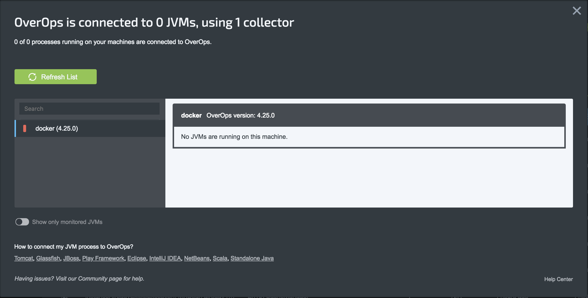

# Deploy a Collector

The Collector [Dockerfile](Dockerfile) is based on the [Linux Rootless Collector Installation](https://doc.overops.com/docs/linux-rootless-collector-install) guide.

_Before deploying the collector, you'll need to [install Docker and Kubernetes](../README.md)_

Two files are needed to run this container: `installation.key` and `collector.properties`. The container expects these two files to be contained in a `private` directory which is mounted into the `/opt/takipi/private` directoy in the container. Alternatively, the Dockerfile can be modified to copy these two files directly into an image. An example [collector.properties](private/collector.properties.saas.example) can be found in this repo. For more details about these files, see the [rootless guide](https://doc.overops.com/docs/linux-rootless-collector-install).

## Build

If you're deploying this image locally on a Minikube cluster, first set the Docker environmental variables:

```console
eval $(minikube docker-env)
```

Build the image and tag it `overops-collector`. This may take some time.

```console
docker build . -t overops-collector
```

## Run in Docker

This container expects a `private` directory containing `installation.key` and `collector.properties` to be mounted into the `/opt/takipi/private` directory. When running the container, we'll mount the `private` directory into the container. Note that mount paths cannot be relative. We'll also forward port 6060 from the host machine to the container.

```console
docker run -p 6060:6060 --mount type=bind,source="$(pwd)"/private,target=/opt/takipi/private overops-collector
```

For debugging, it can be useful to run the container interactively:

```console
docker run --mount type=bind,source="$(pwd)"/private,target=/opt/takipi/private -it overops-collector /bin/bash
```

To run in the background:

```console
docker run -d -p 6060:6060 --mount type=bind,source="$(pwd)"/private,target=/opt/takipi/private overops-collector
```

## Run in Kubernetes

In Kubernetes, we'll store `installation.key` and `collector.properties` as a [Secret](https://kubernetes.io/docs/concepts/configuration/secret/). This allows for streamlined management of installation keys and configurations.

Create the secret from local files:

```console
kubectl create secret generic overops-collector --from-file=./installation.key --from-file=./collector.properties
```

To create a Kubernetes deployment:

```console
kubectl create -f deployment.yaml
```

To make our deployment available to other pods running in the cluster, we'll create a service:

```console
kubectl create -f service.yaml
```

With the service running, go to [app.overops.com](https://app.overops.com/) and confirm your Collector is connected.



To remove the deployment:

```console
kubectl delete -f deployment.yaml
```

To remove the service:

```console
kubectl delete -f service.yaml
```

## Next Steps

- [Create a Pod Preset for the Agent](../agent)
- [Monitoring containerized apps](../demos)
