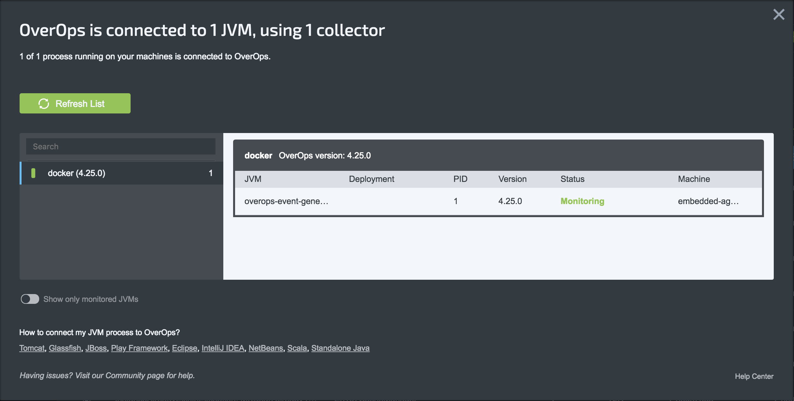

# Embedded Agent Error Generator Demo
This image fetches and installs the Agent. `TAKIPI_AGENT_HOME` and `JAVA_TOOL_OPTIONS` environmental variables are set in the image. `TAKIPI_COLLECTOR_HOST` and `TAKIPI_COLLECTOR_PORT` must be set at runtime.

For this exmaple, we'll create and deploy a Pod to our cluster. If you have not already created the `overops-collector-service`, see *[Deploy a Collector](collector)*.

First, build the image and tag it as `embedded-agent`:

```console
$ docker build . -t embedded-agent
```

Next, create a Pod:

```console
$ kubectl create -f pod.yaml
pod/embedded-agent-pod created
```

When the Pod is running, go to [app.overops.com](https://app.overops.com/) and confirm connectivity:


To delete the pod:

```console
$ kubectl delete -f pod.yaml
pod/embedded-agent-pod deleted
```

### Troubleshooting
- Confirm environmental variables and files are correct. See [Sanity Check](../../agent/#sanity-check)
- Verify the collector deployment `kubectl get deployments`
- Verify the collector service `kubectl get services`
