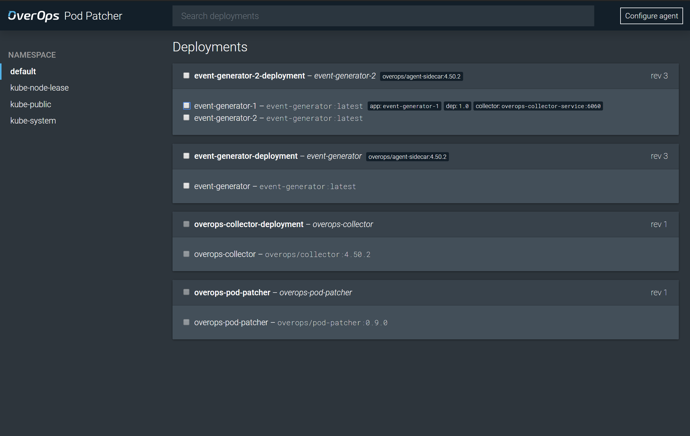
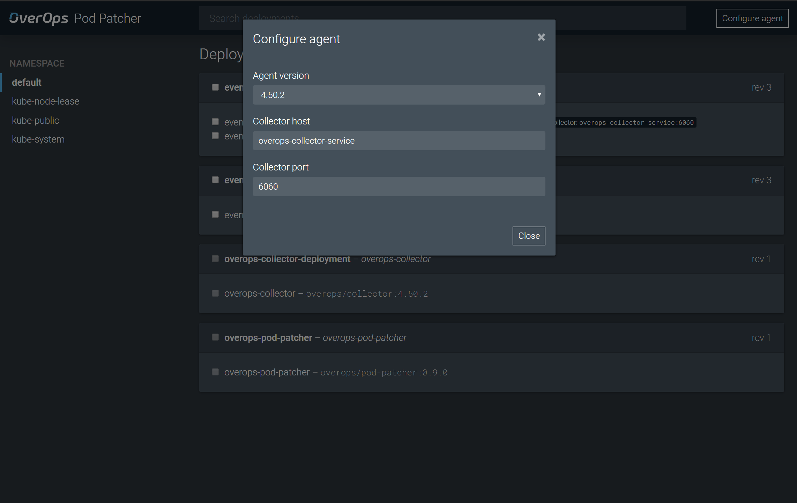
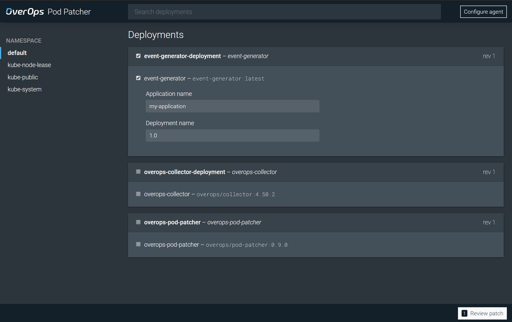
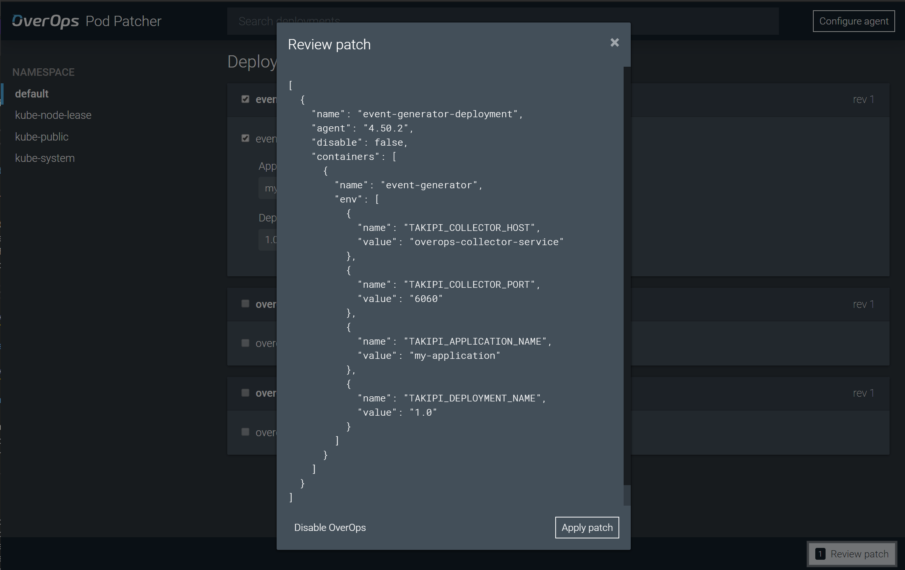
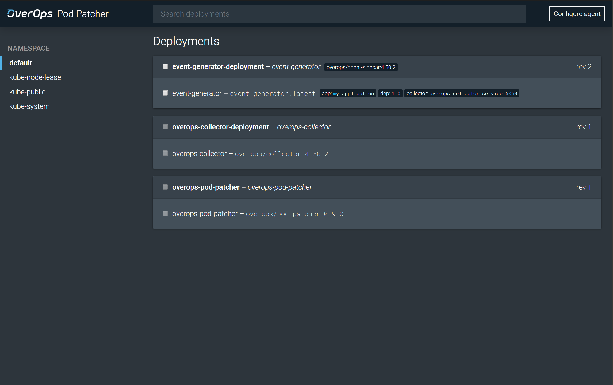
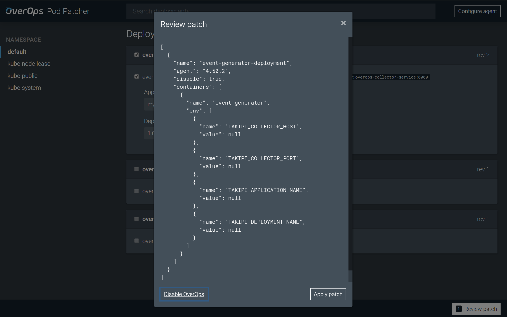

# OverOps Pod Patcher

The Pod Patcher provides a UI for applying the agent sidecar and required environment variables to existing deployments running in a Kubernetes cluster.

This technique leverages the `JAVA_TOOL_OPTIONS` environment variable to attach the agent to the JVM together with an initContainer which supplies the agent to pods using a volume.



## Prerequisites

Before using the Pod Patcher, you must [deploy a collector](../collector) and connect it to the OverOps backend. You'll need to know the hostname and port of the collector to configure the agent. If you've deployed the collector following the examples in this repo, the default hostname of the collector service is `overops-collector-service` and the default port is `6060`.

## Installation

Install the pod patcher in your cluster with the following command:

```sh
kubectl apply -f https://raw.githubusercontent.com/takipi-field/kubernetes/master/overops-pod-patcher/overops-pod-patcher.yaml
```

## Proxy the service with `kubectl`

To access the pod patcher, proxy the Kubernetes API to your local machine:

```sh
kubectl proxy
```

In a browser, navigate to [http://localhost:8001/api/v1/namespaces/default/services/overops-pod-patcher/proxy/](http://localhost:8001/api/v1/namespaces/default/services/overops-pod-patcher/proxy/)

## Configure the agent



Click **Configure agent** in the upper right to select the agent version and specify the collector host and port. By default, the latest agent will be used. If not specified, the default collector host is `overops-collector-service` and the default collector port is `6060`.

*Note - these settings are not persisted. Be sure to check your settings before applying the patch.*

## Patching a deployment



Select entire deployments or individual pods to be patched. Enter an application name and deployment name for each pod, used to identify the app in OverOps.



Click **Review patch** to review changes, then click **Apply patch** to apply the changes.



Once the patch has been applied, a label next to the deployment name will indicate that that agent sidecar has been added. Each pod will display application and deployment names, as well as the collector endpoint.

To update the agent, change the collector endpoint or edit application and deployment names, simply make the desired changes and apply the patch again.

## Disabling OverOps



To disable OverOps, select deployments or pods which have been patched, click **Review patch**, click **Disable OverOps**, then click **Apply patch**.

*Note - disabling OverOps will unset environment variables but will not remove the initContainer or restore the deployment to its original state.*

## Removing all changes

To completely remove the agent sidecar and all environment variables, redeploy your deployment from the original yaml file used to create it.

```sh
kubectl apply -f my-deployment.yaml
```

## Removing the Pod Patcher

```sh
kubectl delete -f overops-pod-patcher.yaml
```
